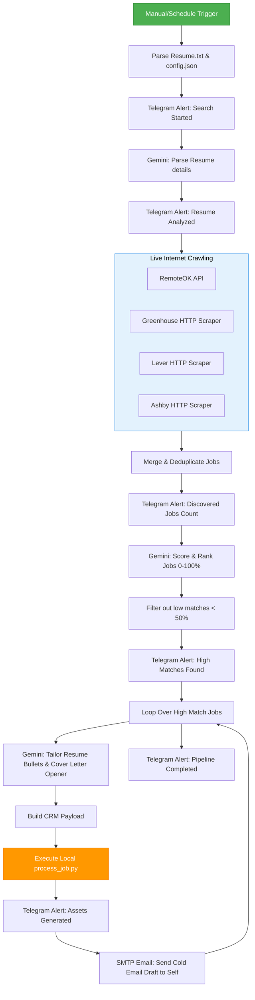

<!-- ========== ANIMATED HEADER BANNER ========== -->
<p align="center">
  
</p>

<!-- ========== TYPING ANIMATION INTRO ========== -->
<p align="center">
  
</p>

<!-- ========== PROFILE VIEWS + FOLLOWERS BADGE ========== -->
<p align="center">
  
  
  
</p>

---

## 🚀 Project Overview

The **Local AI Job Search & Application Tailoring CRM** is a containerized, 100% local recruitment automation system. It orchestrates job crawling, resume parsing, match scoring, database/spreadsheet logging, and tailored document generation using **n8n**, **Python**, and the **Google Gemini API**.

All assets, including SQLite records, custom-tailored `.docx`/`.pdf` resumes, and cover letters, are automatically compiled and stored locally in `D:\AI Job Automation\`.

---

## 🛠️ Used Technology Stack & Versions

| Category | Component / Tool | Version | Description |
|----------|------------------|---------|-------------|
| **Orchestration** | **n8n** | `^2.28.4` | Core event-driven workflow engine |
| **Runtime** | **Node.js** | `v20 (Bookworm slim)` | Base container runtime environment |
| **Runtime** | **Python** | `3.11+` | Backend script execution and doc compiler |
| **AI Model** | **Google Gemini API** | `v1` | Match scoring, resume parsing, and tailoring |
| **Local LLM** | **Ollama** | `v0.1.x` | Fallback local model execution (Qwen2.5) |
| **Database** | **SQLite** | `v3` | Log storage for candidate and job profiles |
| **Excel CRM** | **openpyxl** | `^3.1.5` | Excel worksheet and link formatting generator |
| **Word Docs** | **python-docx** | `^1.2.0` | Word processor for resume/cover letter tailoring |
| **PDF Docs** | **fpdf2** | `^2.8.7` | PDF builder with custom UTF-8 sanitizers |
| **DevOps** | **Docker & Compose** | `v2` | Multi-container environment orchestration |
| **Testing** | **unittest** | (Standard Library) | Isolated testing suite for backend helpers |

---

### 🧠 Core Project Badges


---

## 📐 System Workflow Architecture

The automation pipeline executes event loops to find, score, and customize applications:



---

## 📂 Project Directory Structure

Your developer workspace and host storage directories are organized as follows:

```text
d:\Temp\automation\                # Developer Workspace
├── .env.example                   # Environment configuration template
├── .gitignore                     # Git tracking safety filter
├── AI Job Search...json           # Main n8n Workflow JSON
├── Follow_Up_Automation.json      # Follow-Up Scheduler JSON
├── Dockerfile                     # Custom n8n + Python environment builder
├── docker-compose.yml             # Docker composition script
├── requirements.txt               # Python package dependencies
├── process_job.py                 # Main Python CRM worker
├── generate_workflow.py           # Programmatic n8n workflow compiler
├── inspect_execution.py           # sqlite n8n runtime inspector
└── test_process_job.py            # Unit testing suite

D:\AI Job Automation\              # Production Directory (Mounted on Host)
├── Resume/
│   └── Resume.txt                 # Input master text resume
├── Config/
│   └── config.json                # Job title & location preferences
├── Database/
│   └── jobs.db                    # SQLite CRM database
├── Excel/
│   └── JobTracker.xlsx            # Styled CRM Tracker Sheet (Navy Headers)
├── TailoredResume/
│   └── Resume_[Company]_[Role].*  # Tailored resumes (PDF and DOCX)
├── CoverLetters/
│   └── CoverLetter_[Comp]_[Role].*# Tailored Cover Letters & Cold Email drafts
└── Logs/
    └── automation.log             # Executable script activity log
```

---

## ⚙️ Setup & Execution Guide

### 1. Launch Services via Docker
Start Docker Desktop and initialize the container stack in your terminal:
```powershell
docker compose up -d
```

### 2. Configure Dashboard Credentials
Access **`http://localhost:5678`** in your browser and enter n8n account settings.
Import `AI Job Search_ Resume → Scored Job Matches.json` and configure credentials:
* **Google Gemini API**: Paste your Gemini API key.
* **Telegram Bot API**: Paste your Telegram bot token.
* **SMTP Node**: Enter your Gmail username and app password.

### 3. Execution
Place your master resume at `D:\AI Job Automation\Resume\Resume.txt` and job target parameters at `D:\AI Job Automation\Config\config.json`. Execute the manual run trigger inside the n8n editor, or let the schedule trigger run automatically.

---

## 🧪 Automated Testing
Verify the backend script modules locally using Python's standard `unittest` framework:
```powershell
.\.venv\Scripts\python.exe -m unittest test_process_job.py
```
This tests:
- SQLite database migrations & table creation.
- File and folder naming sanitization.
- FPDF2 Unicode/Latin-1 encoding crash sanitizers.
- DB profile and job CRUD transactions.

---

🏆 **Milestone Output**: Created and verified under recruitment requirements for [Sadique721](https://github.com/Sadique721).

<!-- ========== FOOTER WAVE ANIMATION ========== -->
<p align="center">
  
</p>
